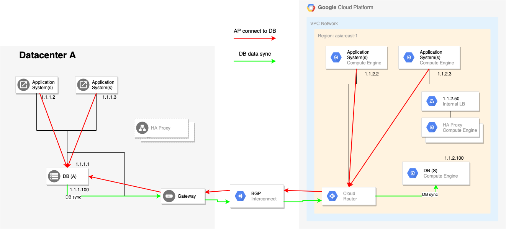

# 舊有資料庫混合雲高可用解決方案

針對企業既有資料庫軟體與網路設計，如何設計一Google Cloud Platform(GCP)混合雲網路架構來實行資料庫搬遷上雲，並滿足雲地高可用設計。下圖為既有資料庫應用的基本架構：

*參考既有構圖：*


- 既有架構為雙資料中心(DC)架構，兩DC間網路被拉在同一子網域，所有IP不分所在DC皆可直接互相路由。
- 當發生DB需要進行切換時，既有流程透過停機時間內，手動修改機器/VM本身實體IP，互換Active and Standby DB的IP。
- 資料庫備份與即時抄寫，透過同樣網路配置，由1.1.1.1抄寫到1.1.2.1。

## 限制條件

基於既有架構，以下為一些額外限制條件：

- 資料庫為Active/Standby架構，且分別座落在資料中心A與資料中心B。
- Active資料庫IP必須固定：由於應用端連結至資料庫數量繁多，且各應用資料庫IP設定方式不盡相同，故要更改為透過主機名稱解析作法不可行。
- 資料庫作主備切換時，可接受部分停機時間。


## 建議架構
以下圖示呈現建議架構圖：以地端資料庫為主要服務端時



**架構說明：**

- 根據以上架構圖，於地端配置基本上保留原樣，配置為1.1.1.0/24的子網域，而應用端設定的資料庫IP仍為1.1.1.1。
- 於地端配置連結到GCP的私有網路配置，這邊透過Cloud Interconnect設立起混合雲網路連結。
- GCP雲端私有網路同既有資料中心B，配置為1.1.2.0/24子網域。
- 混合雲網路連結透過BGP協定，自動設定之動態路由雙向打通雲地兩子網域間的通訊路徑。
- 於GCP上之應用程式亦符合限制條件，設定之資料庫IP為1.1.1.1。

以上架構保有原地端雙資料中心間的應用架構，而在該架構下當發生資料庫需要Failover到GCP上，以GCP作為主站時，就會變遷為以下架構：


**架構說明：**


*地端架構*

- 增設[HAProxy](http://www.haproxy.org/)(可透過Linux HA配置高可用)作為DB路由的Proxy：後端指向GCP上的[內網負載均衡ILB](https://cloud.google.com/load-balancing/docs/internal)(1.1.2.50)。
- 當資料庫作failover切換時，將原Active的資料庫IP改派設定給HAProxy，讓HAProxy承接1.1.1.1的IP。

*GCP端架構*

- 配置一內網負載均衡(1.1.2.50)作為雲端上HAProxy集群之入口。
- HAProxy之後端指向雲上的資料庫，這邊後端資料庫可為任意1.1.2.0/24內的IP。

到此為止的配置，已經能夠讓地端應用維持呼叫1.1.1.1的IP存取到GCP被扶正為Active的資料庫。但GCP上的應用雖同樣可存取到該資料庫，但其路徑會變成流到地端之HAProxy後，又折回到雲端ILB(1.1.2.50)與雲端HAProxy後才訪問到資料庫。

補充說明：

參照架構圖，在此時地端AP應用連結到雲上資料庫之路徑如紅線所示為：AP(DC-A) -> HAProxy(DC-A) -> Gateway -> Interconnect -> Cloud Router -> Internal LB(ILB) -> HAProxy(GCP) -> DB on GCP

而雲端AP應用連結為：**AP(GCP) -> Cloud Router -> Interconnect -> Gateway** -> HAProxy(DC-A) -> Gateway -> Interconnect -> Cloud Router -> Internal LB(ILB) -> HAProxy(GCP) -> DB on GCP

為解決以上問題，以下GCP需配置：

1. 於雲端HAProxy所在VM上設置IP alias為1.1.1.1，如：
```
auto eth0:1
iface eth0:1 inet static
address 1.1.1.1
netmask 255.255.255.255
```

2. 於GCP的VPC配置一條靜態路由將1.1.1.1/32目標都指向ILB(1.1.2.50)

以上配置，第一項配置讓VM OS內不因收到的網路封包目的地不在其身上(該網路子網域為1.1.2.0/24)，而做了一個floating IP的配置來指名該VM是1.1.1.1。而第二項配置是讓GCP上的軟體定義網路(SDN)強制指向在子網域(1.1.2.0/24)內任何傳往1.1.1.1的網路流向都指向到ILB(1.1.2.50)。

另外，記得DB需監聽在0.0.0.0上(偷懶做法XD)，要不然OS吃下封包也不會有應用處理。

至此，就完成了完整切換架構。

