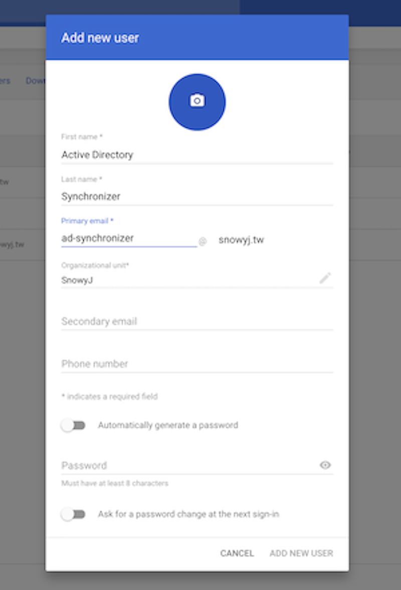

# How to set an external IDP with Cloud Identity for GCP

To authenticate user to log on GCP console, the Google Cloud Identity is the default setup. It's easy for anybody who has a Google account to login. However for business users, many of them already have their existing authentication systems, the Microsoft Active Directory(AD) is a well-known example. To fulfil the use case, Google Cloud Identity can also integrate 3rd-party solution as its' identity provider(IDP).

In the following article, I'm going to show how to setup an external IDP for Cloud Identity to authenticate users log on to GCP console. The whole demo will all build from the ground as you just opened for business. The external IDP I select here is Active Directory (AD) with Active Directory Federation Service (ADFS), you may be using other IDP solutions like Okta, Keycloak, etc.

This article is inspired by the [Google Cloud hybrid cloud solution tutorial](https://cloud.google.com/solutions/federating-gcp-with-active-directory-configuring-single-sign-on), you may find more detail explanation there.

## Getting started
Before following the steps to setup the sample environment, please make sure you got all the prerequisites ready on hands.

The installation process will covers:
1. Install and configure an Active Directory (AD) server.
2. Install Google Cloud Directory Sync and configure it to sync AD identities to Google Cloud Identity.
3. Install and configure an Active Directory Federation Servicer(ADFS) server.
4. Configure Cloud Identity to use ADFS for user authentication.
5. Testing on the deployment.

### Prerequisites
- A domain name which can be resolved on the internet.
- Prepare a valid certificate for the ADFS domain.
- [Register](https://cloud.google.com/identity/signup/premium/welcome) the Google Cloud Identity using the domain name.
- Register Google Cloud Platform account for hosting the AD & ADFS.

### Install and configure an Active Directory (AD) server.

- provision a window server 2016 instance on GCP console.
- install AD and register a custom domain.

### Create Account on Cloud Identity for Directory Sync
1. Login to [Google Admin](https://admin.google.com/) with your administrator account.

2. Click the `Users` -> `Add new user`, then create a user for Directory Sync.

3. Locate the new created user and click it to open.
4. Under Admin roles and privileges, click `Assign Roles`.
5. Assign `Super Admin` role to the user.

### Install Google Cloud Directory Sync and configure it to sync AD identities to Google Cloud Identity.

- create an google identity account for AD sync.
- create an AD account for AD sync.
- install and config Google Cloud Directory Sync.
- create a AD user and test sync.

*Resource*:
download Directory Sync [here](https://tools.google.com/dlpage/dirsync/thankyou.html)

*Tips*:
1. you can either use the `domain\username` or `username@[FQDN]` format for Authorized User under the LDAP Configuration.
2. When create users for testing, the **email** attribute must be set.

### Install and configure an Active Directory Federation Services(ADFS).

- install and configure ADFS to be available to access.
- configure mapping of AD email attribute to SAML NameID
- configure Cloud Identity to use ADFS as external IDP.

### Testing on the deployment.

- Login to GCP console with an AD user account.

//////////////////////////////////////////////////////////////////////