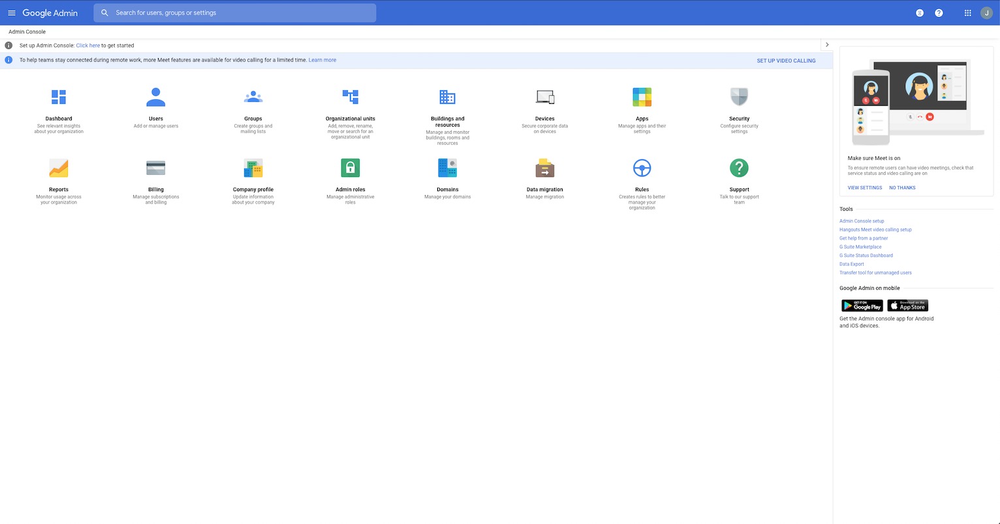
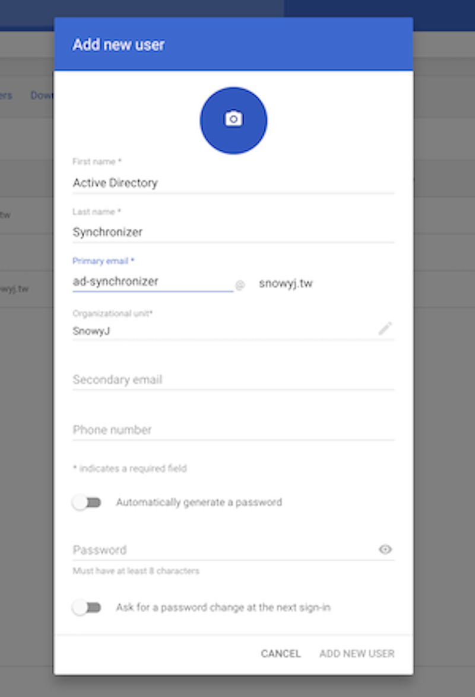
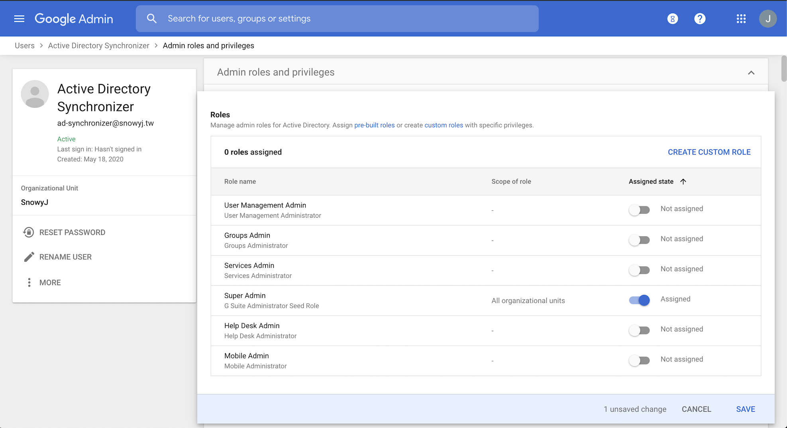

# 如何於GCP上設置外部身份認證(external IDP)

在使用Google Cloud Platform時，當要登入至[GCP主控台](https://console.cloud.google.com/)，預設的使用者驗證來源為Google Cloud Identity。 只要擁有Google帳號的使用者，都可以非常輕易的登入使用。 然而，對於大多數的企業IT來說，既有公司的環境內早已有公司內定的身份認證服務，Microsoft Active Directory(AD)就是一個知名的例子。為了滿足企業用戶的需要，Google Cloud Identity支援與外部第三方身份認證服務(IDP)做整合。

在以下文章，我將展示如何設定一個外部IDP給Cloud Identity作GCP主控台身份認證使用。 整個配置Demo將從頭開始，當作一間剛創立的公司從頭建起整個環境。而在這邊外部IDP的選擇，將採用Active Directory (AD)搭派Active Directory Federation Service (ADFS)作為公司哪認證服務。按需要外部IDP亦可能為其他方案，如：Okta, Keycloak等。


此篇文章是參考[Google Cloud混合雲解決方案教程](https://cloud.google.com/solutions/federating-gcp-with-active-directory-configuring-single-sign-on)，更多的資訊你可以在該連結內找到。

## 準備開始
在按照步驟執行下面操作之前，請先確認已準備好所有預先準備。

之後的安裝過程，簡略來說將包括：
1.安裝和配置Active Directory（AD）服務。
2.安裝Google Cloud Directory Sync，並將其配置為將AD身份同步到Google Cloud Identity。
3.安裝並配置Active Directory Federation Servicer(ADFS)服務器。
4.將Cloud Identity配置為使用ADFS進行用戶身份驗證。
5.對整體方案進行測試。

### 預先準備
- 可以在Internet上解析的域名。
- 準備一個有效網域憑證(之後將用在ADFS設定上)。
- [註冊](https://cloud.google.com/identity/signup/premium/welcome)Google Cloud Identity。
- 註冊將用於託管AD和ADFS的Google Cloud Platform帳戶。

### A. 安裝與配置Active Directory (AD) 伺服器.

[](https://youtu.be/ztP-Yvn8TZE)

- 在GCP主控台上，創建一台window server 2016的運行伺服器。
- 安裝AD並註冊一個自定義域名。

*提示*:
- 當配置創建Windows 2016伺服器時，為了之後ADFS使用，記得先勾選`允許 HTTPS 流量`。
- 安裝Microsoft Remote Desktop用戶端程式，以協助在遠端桌面中複製/貼上命令，並支持與本機作分享資料夾。
  - for [Windwos](https://www.microsoft.com/en-us/p/microsoft-remote-desktop/9wzdncrfj3ps#activetab=pivot:overviewtab)
  - for [Mac](https://apps.apple.com/tw/app/microsoft-remote-desktop/id1295203466?mt=12)

### B. Create Account on Cloud Identity for Directory Sync
1. 使用你的`管理者帳號`登入到[Google Admin](https://admin.google.com/)。



2. 點選`使用者` -> `新增使用者`，然後新增一個給Directory Sync使用的帳號。



3. 找到新建立的使用者並點擊打開。
4. 在*管理員角色與權限*下，點擊`已指派角色`.
5. 指派`超級管理員`角色給該帳號。



### C. 安裝Google Cloud Directory Sync並配置它，作AD身份同步至Google Cloud Identity

[](https://youtu.be/u3fiFLDf4Tg)

- 產生一個Google Identity帳戶，專門用作AD同步
- 產生一個AD帳戶，專門用作AD同步。
- 安裝並配置Google Cloud Directory Sync。
- 產生一個一般AD帳戶用於測試同步功能。

*資源*:
- 下載Directory Sync連結[在此](https://tools.google.com/dlpage/dirsync/thankyou.html)
- PowerShell命令，用於產生Windows內環境資料夾(`c:\ProgramData\gcds`)，之後將用於儲存GCDS配置檔。

````
$gcdsDataFolder = "$Env:ProgramData\gcds"
New-Item -ItemType directory -Path  $gcdsDataFolder
&icacls "$gcdsDataFolder" /inheritance:r
&icacls "$gcdsDataFolder" /grant:r "CREATOR OWNER:(OI)(CI)F" /T
&icacls "$gcdsDataFolder" /grant   "BUILTIN\Administrators:(OI)(CI)F" /T
&icacls "$gcdsDataFolder" /grant   "Domain Admins:(OI)(CI)F" /T
&icacls "$gcdsDataFolder" /grant   "LOCAL SERVICE:(OI)(CI)F" /T

Write-Host $Env:ProgramData
````

*提示*:
1. 在配置GCDS的Authorized User(在LDAP Configuration頁籤下)，兩種帳號格式皆可：`domain\username` 或是 `username@[FQDN]`。
2. 預設的query rule將搜尋出所有email欄位有值的帳號。

``(&(objectCategory=person)(objectClass=user)(mail=*)(!(userAccountControl:1.2.840.113556.1.4.803:=2)))``

3. 當產生AD帳號用來測試同步功能時，**email**欄位必須設置，該欄位之後將被配置成為Cloud Identity用戶ID。

### D. 安裝與配置 Active Directory Federation Services(ADFS).

[](https://youtu.be/af_mjXHbSQQ)

- 安裝與配置 ADFS，使其能夠被用戶訪問。
- 配置將AD email欄位映射到SAML NameID。
- 配置Cloud Identity以採用ADFS作為其外部IDP。

*資源*:

*提示*:

- 在ADFS安裝過程中，一個有效的PTX格式的SSL憑證會被需要，憑證產生與簽署的部分可以參考：[使用Let's Encrypt產生SSL憑證](https://medium.com/@saurabh6790/generate-wildcard-ssl-certificate-using-lets-encrypt-certbot-273e432794d7)

### E. 情境測試

[](https://youtu.be/6u0WblK6Kb8)

- 使用AD帳戶登入GCP主控台。


### F. 排程AD同步

[](https://youtu.be/ssvLMPBh1WQ)

- 為GCDS產生一份PowerShell運行腳本(ps1)。
- 為ps1腳本，設置排程工作。
- 手動觸發排程做驗證。

*資源*:

- PowerShell運行腳本範例

````
[CmdletBinding()]
Param(
    [Parameter(Mandatory=$True, Position=1)]
    [string]$config,

    [Parameter(Mandatory=$True, Position=1)]
    [string]$gcdsInstallationDir
)

import-module ActiveDirectory

# Stop on error.
$ErrorActionPreference ="stop"

# Ensure it's an absolute path.
$rawConfigPath = [System.IO.Path]::Combine((pwd).Path, $config)

# Discover closest GC in current domain.
$dc = Get-ADDomainController -discover -Service "GlobalCatalog" -NextClosestSite
Write-Host ("Using Global Catalog server {0} of domain {1} as LDAP source" -f [string]$dc.HostName, $dc.Domain)

# Load XML and replace the endpoint.
$dom = [xml](Get-Content $rawConfigPath)
$ldapConfigNode = $dom.SelectSingleNode("//plugin[@class='com.google.usersyncapp.plugin.ldap.LDAPPlugin']/config")

# Tweak the endpoint.
$ldapConfigNode.hostname = [string]$dc.HostName
$ldapConfigNode.ldapCredMachineName = [string]$dc.HostName
$ldapConfigNode.port = "3268"   # Always use Global Catalog port

# Tweak the tsv files location
$googleConfigNode = $dom.SelectSingleNode("//plugin[@class='com.google.usersyncapp.plugin.google.GooglePlugin']/config")
$googleConfigNode.nonAddressPrimaryKeyMapFile = [System.IO.Path]::Combine((pwd).Path, "nonAddressPrimaryKeyFile.tsv")
$googleConfigNode.passwordTimestampFile = [System.IO.Path]::Combine((pwd).Path, "passwordTimestampCache.tsv")

# Save resulting config.
$targetConfigPath = $rawConfigPath + ".autodiscover"

$writer = New-Object System.IO.StreamWriter($targetConfigPath, $False, (New-Object System.Text.UTF8Encoding($False)))
$dom.Save($writer)
$writer.Close()

# Run synchronization.
Start-Process -FilePath "$gcdsInstallationDir\sync-cmd" `
    -Wait -ArgumentList "--apply --loglevel INFO --config ""$targetConfigPath"""
````

- 從你個人profile複製GCDS所需之金鑰至`NT AUTHORITY\LOCAL SERVICE`的profile：

````
New-Item -Path Registry::HKEY_USERS\S-1-5-19\SOFTWARE\JavaSoft\Prefs\com\google\usersyncapp -Force

Copy-Item -Path Microsoft.PowerShell.Core\Registry::HKEY_CURRENT_USER\SOFTWARE\JavaSoft\Prefs\com\google\usersyncapp\util `
    -Destination Microsoft.PowerShell.Core\Registry::HKEY_USERS\S-1-5-19\SOFTWARE\JavaSoft\Prefs\com\google\usersyncapp\util
````

- 排程配置範例

````
$taskName = "Synchronize to Cloud Identity"
$gcdsDir = "$Env:ProgramData\gcds"

$action = New-ScheduledTaskAction -Execute 'PowerShell.exe' `
  -Argument "-ExecutionPolicy Bypass -NoProfile $gcdsDir\sync.ps1 -config $gcdsDir\config.xml -gcdsInstallationDir '$Env:Programfiles\Google Cloud Directory Sync'" `
  -WorkingDirectory $gcdsDir
$trigger = New-ScheduledTaskTrigger `
  -Once `
  -At (Get-Date) `
  -RepetitionInterval (New-TimeSpan -Minutes 60) `
  -RepetitionDuration (New-TimeSpan -Days (365 * 20))

$principal = New-ScheduledTaskPrincipal -UserID "NT AUTHORITY\LOCAL SERVICE" -LogonType ServiceAccount
Register-ScheduledTask -Action $action -Trigger $trigger -Principal $principal -TaskName $taskName

$task = Get-ScheduledTask -TaskName "$taskName"
$task.Settings.ExecutionTimeLimit = "PT12H"
Set-ScheduledTask $task
````

### 延伸筆記
- 用命令列手動執行GCDS
````
// Simulate
C:\Program Files\Google Cloud Directory Sync> .\sync-cmd.exe -c c:\ProgramData\gcds\config.xml
// Commit
C:\Program Files\Google Cloud Directory Sync> .\sync-cmd.exe -c c:\ProgramData\gcds\config.xml
````
